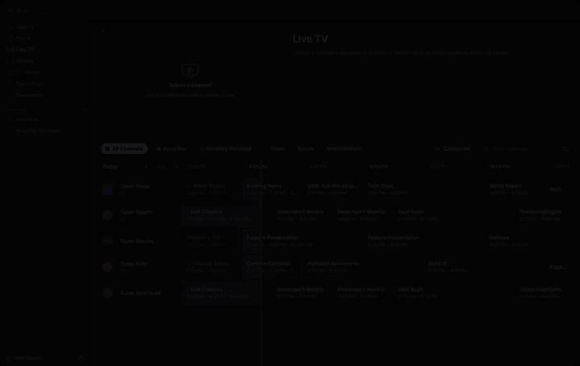
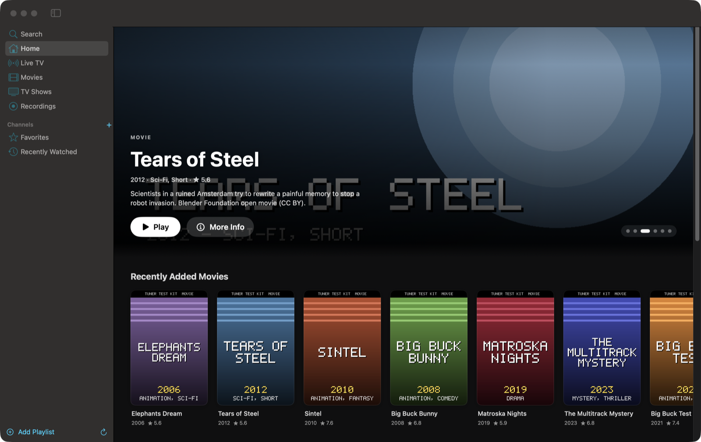
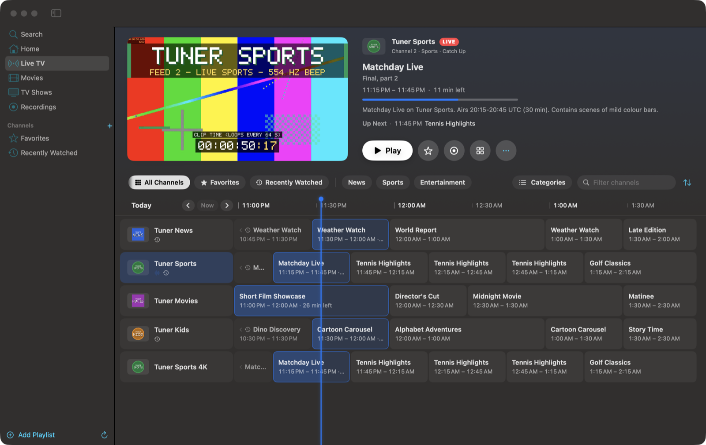
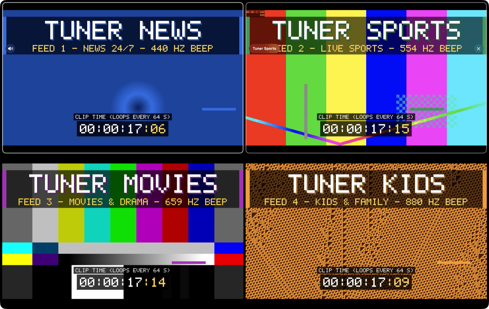
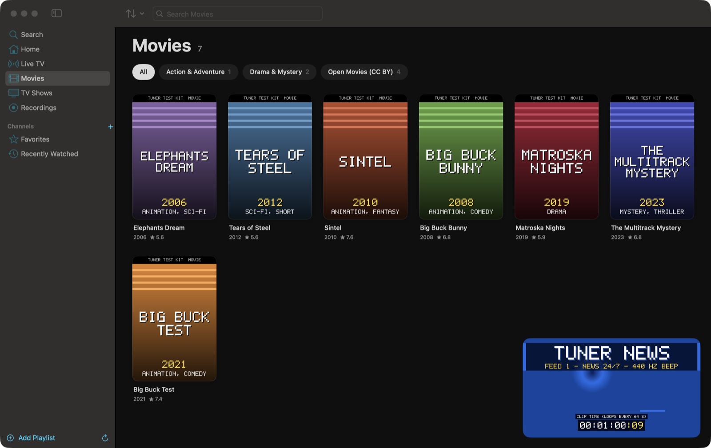
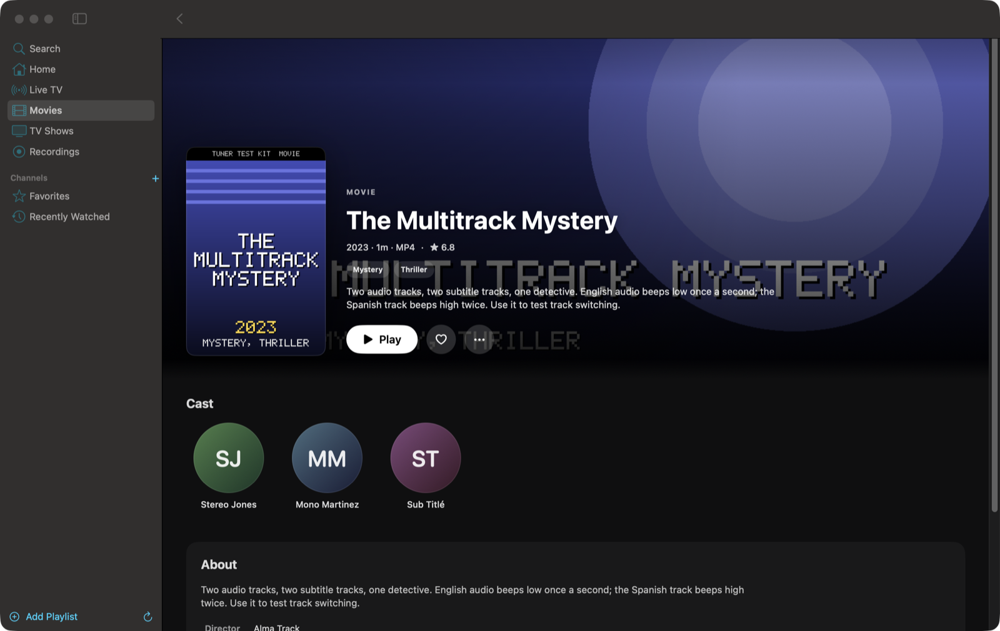
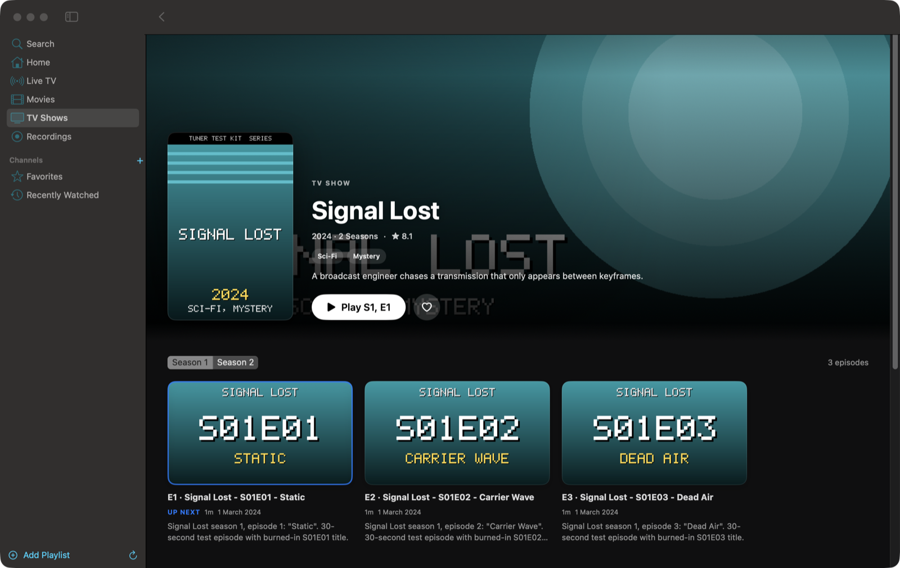
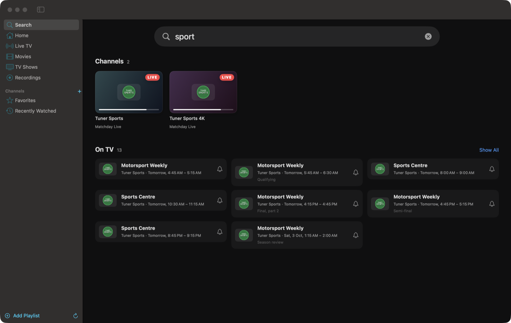
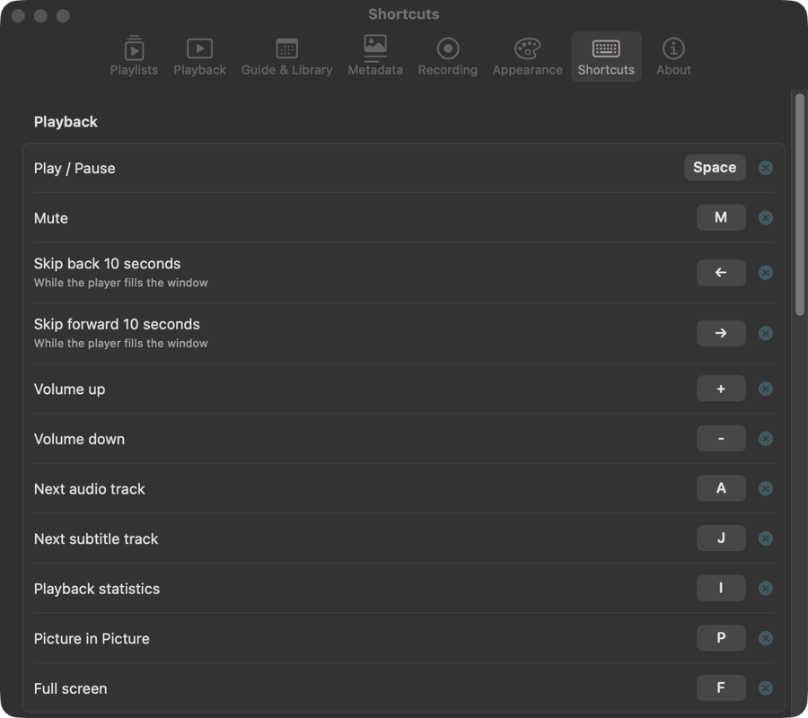
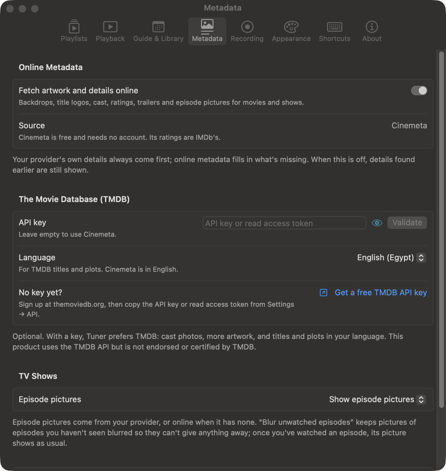

# Tuner

A native macOS IPTV player with an Apple TV app–style experience — SwiftUI + AppKit + AVFoundation,
modelled on the feature set of [ynotv](https://github.com/tbeezy/ynotv) (see `docs/ynotv-reference.md`).



▶︎ Full demo video (40 s, 1600×1012): [`docs/media/tuner-demo.mp4`](docs/media/tuner-demo.mp4)

| Home | Live TV guide with preview |
|---|---|
|  |  |
| **Player** | **Multiview (2×2)** |
|  |  |
| **Movies with the mini player** | **Movie details** |
|  |  |
| **TV show with seasons** | **Search: channels and what's on** |
|  |  |
| **Settings → Shortcuts** | **Settings → Metadata** |
|  |  |

<sub>Screenshots and video use the local test kit (`scripts/testkit`): synthetic channels and titles, plus four
Blender Foundation open movies (CC BY). No provider content is shown.</sub>

- **Sources:** M3U/M3U8 playlists (URL or file, gzip), Xtream Codes, Stalker/MAG portals; backup server URLs.
- **Live TV:** Apple-styled guide grid with live preview, categories, favourites, custom groups, recently watched,
  channel zapping, catchup/timeshift (Xtream, Flussonic, append/shift and `catchup-source` templates, Stalker).
- **Guide:** XMLTV (gzip, multi-member), provider guides (Xtream `xmltv.php`, M3U `url-tvg`, Stalker), extra and
  global feeds, automatic matching by tvg-id or normalised name, per-source time shift, programme search, reminders
  with auto-switch.
- **Movies & TV Shows:** browsing with posters, details, seasons/episodes, resume and Continue Watching.
- **Player:** AVFoundation first (HLS, MP4; PiP, AirPlay), automatic libmpv fallback for raw MPEG-TS/MKV and
  other formats; stall watchdog with failover to duplicate channels and reconnect; audio/subtitle tracks; stats.
- **Multiview:** single, picture-in-picture, main + 3, 2×2.
- **AirPlay:** send video to an Apple TV or AirPlay display from the player's top bar. Streams that were opened
  with mpv are reopened in Apple's player automatically when their format allows (Xtream live via HLS, MP4,
  HLS). Formats AirPlay can't take directly (MKV, raw TS, HEVC in TS) are re-wrapped on the Mac by ffmpeg
  (`-c copy`, no quality loss) into HLS served on the local network.
- **HEVC channels:** streams whose video Apple's player can't decode (HEVC in MPEG-TS HLS plays as sound only)
  are detected and reopened in mpv automatically, instead of showing a black picture.
- **Online metadata:** Cinemeta (no account) or TMDB (your API key) adds title logos, backdrops, cast, ratings,
  trailers and episode pictures; episode pictures can be shown, blurred until watched, or hidden.
- **Keyboard & media keys:** single-key shortcuts (Space, ←/→, ↑/↓, M, F, Esc…), all remappable in
  Settings → Shortcuts (`/` shows the current keys); ⌘ equivalents in the menu bar; hardware media keys,
  AirPods and Control Center's Now Playing control playback (next/previous = channel zap for live TV, next
  episode for shows).
- **Recordings:** record now or schedule from the guide (ffmpeg stream copy).

## Requirements

- macOS 15 or later (Liquid Glass on macOS 26+), Apple silicon or Intel.
- Swift 6 toolchain (Command Line Tools are enough — Xcode is not required).
- Optional: `brew install mpv` (MPEG-TS/MKV playback) and `brew install ffmpeg` (recordings).

## Build & run

```bash
scripts/build-app.sh            # release build → build/Tuner.app
open build/Tuner.app
```

During development you can also `swift run Tuner`.

## Test

```bash
scripts/test.sh                 # TunerCore unit tests (Swift Testing)
```

`docs/testing.md` describes the local test kit: synthetic channels, a mock Xtream server and a live guide.

## Layout

| Path | What |
|---|---|
| `Sources/TunerCore` | UI-free core: models, M3U/XMLTV parsers, Xtream/Stalker clients, SQLite (GRDB), sync, guide, stream resolution, DVR |
| `Sources/Tuner` | The SwiftUI app: app model, player engines and controller, views |
| `Sources/CMPV` | libmpv headers + runtime loader (libmpv is `dlopen`ed, never linked) |
| `Sources/CZlib` | gzip via the system zlib |
| `docs/` | Design, ynotv reference notes, testing guide |

Data lives in `~/Library/Application Support/Tuner/` (SQLite). Recordings default to `~/Movies/Tuner Recordings`.

Tuner is a media player only; it does not provide any channels or content.
