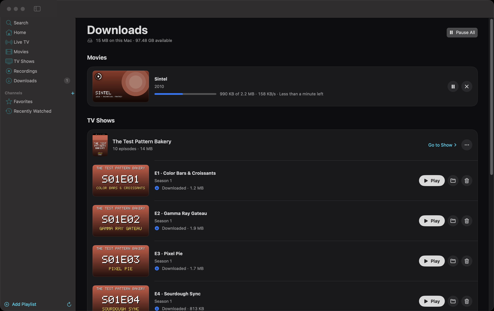
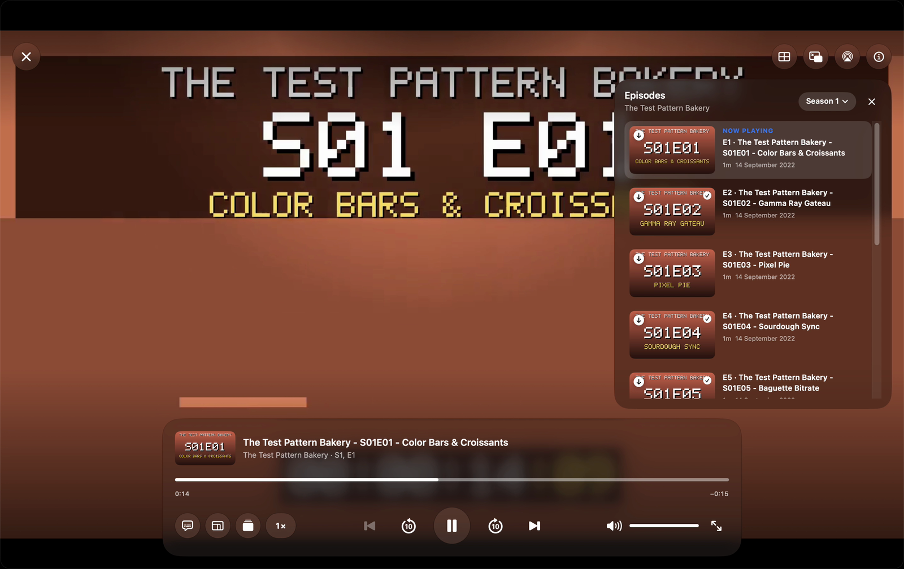
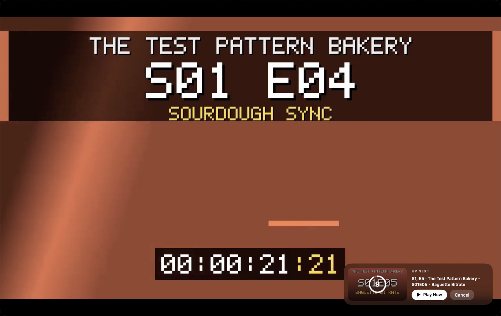
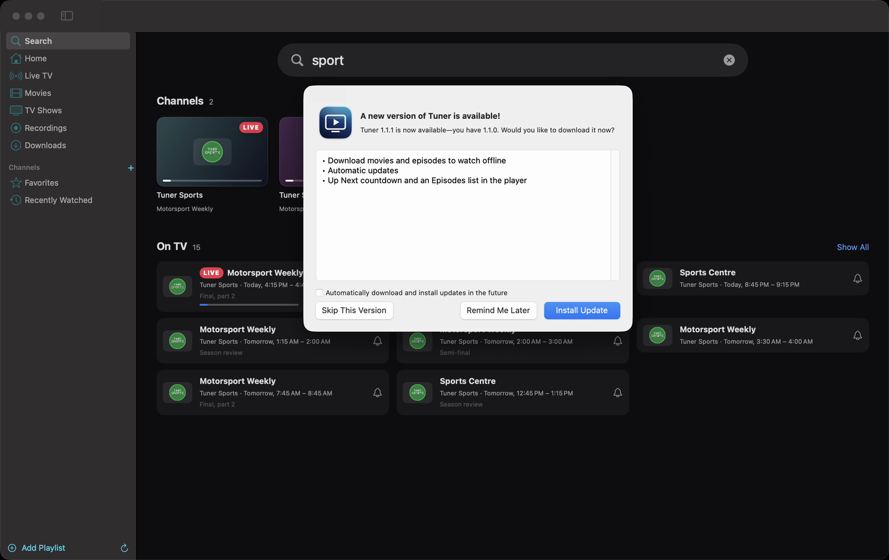

# Tuner

A native IPTV player for **Mac, iPhone and iPad** with an Apple TV app–style experience — SwiftUI + AVFoundation
(+ AppKit on the Mac), modelled on the feature set of [ynotv](https://github.com/tbeezy/ynotv)
(see `docs/ynotv-reference.md`). One codebase: the iPhone/iPad app compiles the Mac app's sources
(see [iPhone and iPad](#iphone-and-ipad)).


▶︎ Full demo video (61 s, 1600×1008): [`docs/media/tuner-demo.mp4`](docs/media/tuner-demo.mp4)

| Home | Live TV guide with preview |
|---|---|
|  |  |
| **Player** | **Movies with the mini player** |
|  |  |
| **Movie details** | **TV show with seasons** |
|  |  |
| **Search: channels and what's on** | **Downloads for offline viewing** |
|  |  |
| **Episodes in the player** | **Up Next countdown** |
|  |  |
| **Automatic updates** | **Settings → Shortcuts** |
|  |  |
| **Settings → Metadata** | |
|  | |

<sub>Screenshots and video use the local test kit (`scripts/testkit`): synthetic channels and titles, plus four
Blender Foundation open movies (CC BY). No provider content is shown.</sub>

- **Sources:** M3U/M3U8 playlists (URL or file, gzip), Xtream Codes, Stalker/MAG portals; backup server URLs.
- **Live TV:** Apple-styled guide grid with live preview, categories, favourites, custom groups, recently watched,
  channel zapping, catchup/timeshift (Xtream, Flussonic, append/shift and `catchup-source` templates, Stalker).
- **Guide:** XMLTV (gzip, multi-member), provider guides (Xtream `xmltv.php`, M3U `url-tvg`, Stalker), extra and
  global feeds, automatic matching by tvg-id or normalised name, per-source time shift, programme search, reminders
  with auto-switch.
- **Movies & TV Shows:** browsing with posters, details, seasons/episodes, resume and Continue Watching.
  Providers' long category lists are grouped into a few menus — Featured, Languages & Countries, Platforms, Genres,
  By Year, Sports, Kids, Quality, More — read from English and Arabic category names. Pin the categories you use
  (they become chips), hide the rest, and choose whether names show their English part, their Arabic part or the
  provider's full name (Categories next to the page title). Each page
  shows the playlist's own title (also under a title logo from online metadata) and where it's listed
  (Playlist › Category). Trailers
  play inside the app (YouTube's official embedded player, or Apple's player for direct links).
- **Episodes in the player:** ⏮/⏭ previous/next episode (across seasons; ⌘⇧←/→), an Episodes panel to jump to any
  episode with its picture, progress and **IMDb rating**, and a Netflix-style "Up Next" countdown (Off/5–30 s in
  Settings → Playback) with Play Now and Cancel. Episode ratings come from IMDb's public data sets (≈64 MB, downloaded
  on first use and refreshed weekly; Cinemeta's episode ratings aren't IMDb's).
- **Downloads & offline:** download a movie, an episode or a whole season (Downloads in the sidebar, ⌘6) and
  watch it without a connection: a downloaded title always plays from the Mac. Downloads run one at a time in watch
  order, resume where they stopped (after a pause, a lost connection or a relaunch), and pause automatically while
  you stream from an account that allows a single connection. Files are saved as
  `Movies/<Title> (<Year>).<ext>` and `TV Shows/<Show>/Season N/<Show> - S01E03 - <Title>.<ext>` in
  `~/Movies/Tuner Downloads` (Settings → Downloads), so other players can open them too.
- **Automatic updates:** releases from GitHub install themselves with [Sparkle](https://sparkle-project.org)
  (Tuner → Check for Updates…, Settings → About). Each update is signed (EdDSA) and verified before it's installed.
- **Player:** AVFoundation first (HLS, MP4; PiP, AirPlay), automatic libmpv fallback for raw MPEG-TS/MKV and
  other formats; stall watchdog with failover to duplicate channels and reconnect; audio/subtitle tracks; stats.
- **AirPlay:** send video to an Apple TV or AirPlay display from the player's top bar. Streams that were opened
  with mpv are reopened in Apple's player automatically when their format allows (Xtream live via HLS, MP4,
  HLS). Formats AirPlay can't take directly (MKV, raw TS, HEVC in TS) are re-wrapped on the Mac by ffmpeg
  (`-c copy`, no quality loss) into HLS served on the local network.
- **HEVC channels:** streams whose video Apple's player can't decode (HEVC in MPEG-TS HLS plays as sound only)
  are detected and reopened in mpv automatically, instead of showing a black picture.
- **Online metadata:** Cinemeta (no account) or TMDB (your API key) adds title logos, backdrops, cast, ratings,
  trailers and episode pictures; episode pictures can be shown, blurred until watched, or hidden.
- **Keyboard & media keys:** single-key shortcuts in the player (Space, ←/→ seek, ↑/↓ volume, Page Up/Down channels, M, F, Esc…), all remappable in
  Settings → Shortcuts (`/` shows the current keys); ⌘ equivalents in the menu bar; hardware media keys,
  AirPods and Control Center's Now Playing control playback (next/previous = channel zap for live TV, next
  episode for shows).
- **Search:** channels, what's on TV, movies and shows across all playlists; recent searches are kept (the ones you
  pressed Return on, opened or played) and shown while the field is empty.
- **Recordings (Mac):** record now or schedule from the guide (ffmpeg stream copy).

## iPhone and iPad

The same app runs on iPhone and iPad (iOS/iPadOS 26+). It isn't on the App Store: you install it on your own
devices from Xcode, with a free Apple ID or a paid developer account.

**What's different on iPhone/iPad**

| | Mac | iPhone / iPad |
|---|---|---|
| Navigation | Sidebar | Tab bar (iPad: top bar that opens as a sidebar) |
| Live TV | Guide grid with preview | iPhone: channel list with now/next; iPad: guide grid |
| Player | Pointer-driven control panel, keyboard shortcuts | Touch layout: transport on the video, "…" menu, swipe down to close, Rotate; hardware volume |
| Engines | AVFoundation, libmpv (Homebrew) fallback | AVFoundation, libmpv ([MPVKit](https://github.com/mpvkit/MPVKit)) fallback, built in |
| Picture in Picture | AVFoundation streams | AVFoundation streams (MKV and other mpv-only formats: no PiP) |
| AirPlay | All formats (ffmpeg re-wraps the rest) | AVFoundation streams; others via Screen Mirroring |
| Recordings | Yes (ffmpeg) | No (iOS apps can't run ffmpeg) |
| Downloads | `~/Movies/Tuner Downloads` (choose in Settings) | Files › On My iPhone › Tuner › Downloads (not in iCloud backups) |
| Updates | Automatic (Sparkle) | Reinstall from the checkout (below) |

Everything else — sources, sync, guide, metadata, categories, search, episodes and Up Next, downloads —
is the same code on both.

**Install on your iPhone/iPad** (needs Xcode 26+ with the iOS platform, and `brew install xcodegen`):

1. In Xcode → Settings → Accounts, sign in with your Apple ID. Note your team ID.
2. `cp iOS/Config/Local.xcconfig.example iOS/Config/Local.xcconfig`, then set your team ID (`DEVELOPMENT_TEAM`) and
   a bundle ID of your own (`TUNER_BUNDLE_ID`). The file is git-ignored.
3. Connect the device with a cable, unlock it and tap **Trust**. Turn on **Settings → Privacy & Security →
   Developer Mode** (the device restarts).
4. Run:
   ```bash
   iOS/scripts/install-device.sh
   ```
5. The first time, allow the app on the device: **Settings → General → VPN & Device Management** → your Apple ID →
   Trust.

With a **free Apple ID** the install expires after 7 days (your library and settings are kept): run the script
again before then, or install a login agent that does it every 5 days while the device is connected (or on the same
Wi-Fi with wireless pairing):

```bash
iOS/scripts/install-resign-agent.sh            # --remove to uninstall it
```

A paid Apple Developer Program membership makes installs last a year.

## Install

**Recommended** — one command in Terminal installs the latest release into Applications and opens it:

```bash
curl -fsSL https://raw.githubusercontent.com/AhmedEzzat12/iptv-player-macos/main/scripts/install-latest.sh | bash
```

Run the same command again any time to reinstall. After that the app updates itself (Tuner → Check for Updates…,
Settings → About). Optional: `brew install mpv` (MKV and raw MPEG-TS streams) and `brew install ffmpeg` (recordings).

**Or build from source** — for Macs where downloaded apps are blocked by an organization's profile, or to run
unreleased changes. Needs the Command Line Tools (`xcode-select --install`):

```bash
git clone https://github.com/AhmedEzzat12/iptv-player-macos.git
cd iptv-player-macos
scripts/update-from-source.sh          # latest release
scripts/update-from-source.sh --main   # or: newest code on main
```

It builds in a temporary checkout (deleted afterwards, even on failure or Ctrl-C), replaces any installed copy, installs
the new build into `~/Applications` and opens it. Your library and settings are kept. Source builds don't update
themselves — run the script again to update.

**Or download manually:** get `Tuner.zip` from the [latest release](../../releases/latest), unzip it and move
`Tuner.app` to Applications. The first launch will be blocked — see below.

### "Tuner.app" Not Opened / "Apple could not verify…"

The app is free and open source but not notarized by Apple (that needs a paid developer account), so macOS blocks
copies downloaded in a browser. Any **one** of these fixes it, and you only need it once — updates installed by the
app itself aren't blocked:

1. **System Settings:** click **Done** on the warning, open **System Settings → Privacy & Security**, scroll to
   *Security*, click **Open Anyway** next to "Tuner.app was blocked", and confirm with your password.
2. **Terminal:** remove the download's quarantine flag, then open the app normally:
   ```bash
   xattr -dr com.apple.quarantine /Applications/Tuner.app
   ```
3. **Reinstall with the one-command installer above** — `curl` downloads aren't quarantined, so the warning never
   appears.

## Requirements

- Mac: macOS 15 or later (Liquid Glass on macOS 26+), Apple silicon or Intel.
- iPhone/iPad: iOS/iPadOS 26 or later; building needs Xcode 26+ and XcodeGen (see above).
- Swift 6 toolchain (Command Line Tools are enough — Xcode is not required).
- Optional: `brew install mpv` (MPEG-TS/MKV playback) and `brew install ffmpeg` (recordings).

## Build & run

```bash
scripts/build-app.sh            # release build → build/Tuner.app
open build/Tuner.app
```

During development you can also `swift run Tuner`. Builds made this way don't update themselves (only release
builds carry the update-signing key).

## Test

```bash
scripts/test.sh                 # TunerCore unit tests (Swift Testing)
iOS/scripts/check-build.sh      # the iPhone/iPad app still compiles (Xcode + XcodeGen)
```

`docs/testing.md` describes the local test kit: synthetic channels, a mock Xtream server and a live guide.

## Releasing

One version for both apps: `VERSION` (e.g. `1.2.0`) is the marketing version of the Mac and the iPhone/iPad app,
and the build number of both is the commit count on `main`. A release is a tag `v<version>` on `main`.

1. Bump `VERSION` (patch for fixes, minor for features), commit on `main` and push.
2. Publish the Mac release from your Mac with the GitHub CLI (`brew install gh && gh auth login`):
   ```bash
   scripts/release.sh
   ```
   It runs the tests, checks that the iPhone/iPad app still compiles (`SKIP_IOS_CHECK=1` skips that on a Mac
   without Xcode), builds the Mac app, signs the update with your Sparkle key, writes `appcast.xml` and creates
   GitHub release `v<version>` with `Tuner.zip` and the appcast. Installed Macs check
   `releases/latest/download/appcast.xml` daily and offer the update.
3. Update your iPhone/iPad from the same commit: `git pull && iOS/scripts/install-device.sh` (the login agent, if
   installed, installs whatever the checkout holds the next time it runs).

- The signing key lives in your login keychain. The first run creates it (Keychain may ask); Soonbar uses the same
  key. **Back it up once** — without it, installed copies can't verify future updates:
  `"$(find .build/artifacts -path '*Sparkle/bin' -type d | head -1)/generate_keys" -x ~/sparkle-private-key.txt`,
  then move that file into a password manager.
- The repository must be public for installed copies to download updates.

## Layout

| Path | What |
|---|---|
| `Sources/TunerCore` | UI-free core: models, M3U/XMLTV parsers, Xtream/Stalker clients, SQLite (GRDB), sync, guide, stream resolution, DVR, category grouping |
| `Sources/Tuner` | The SwiftUI app, shared by Mac and iPhone/iPad: app model, player engines and controller, views. Mac-only code is behind `#if os(macOS)`; iPhone layouts behind the `tunerCompact` environment flag |
| `iOS/` | The iPhone/iPad app: XcodeGen project (`project.yml`, builds `../Sources/Tuner`), iOS versions of the AppKit-only pieces (`Sources/`), signing config (`Config/`), install scripts (`scripts/`) |
| `Sources/CMPV` | libmpv headers + runtime loader (libmpv is `dlopen`ed, never linked) |
| `Sources/CZlib` | gzip via the system zlib |
| `docs/` | Design, ynotv reference notes, testing guide |

Data lives in `~/Library/Application Support/Tuner/` (SQLite; on iPhone/iPad in the app's own container). Recordings
default to `~/Movies/Tuner Recordings`, downloads to `~/Movies/Tuner Downloads` (iPhone/iPad: Files › Tuner ›
Downloads).

Tuner is a media player only; it does not provide any channels or content. Automatic updates use
[Sparkle](https://github.com/sparkle-project/Sparkle) (MIT-style license). The iPhone/iPad app bundles libmpv and
FFmpeg through [MPVKit](https://github.com/mpvkit/MPVKit) (GPL build; it's only installed on your own devices,
never distributed).
